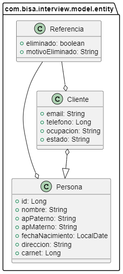
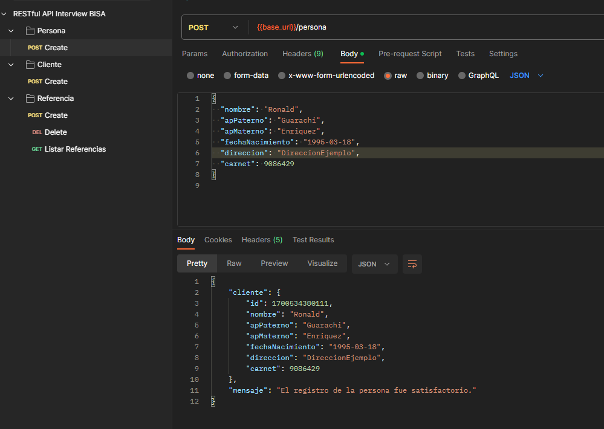
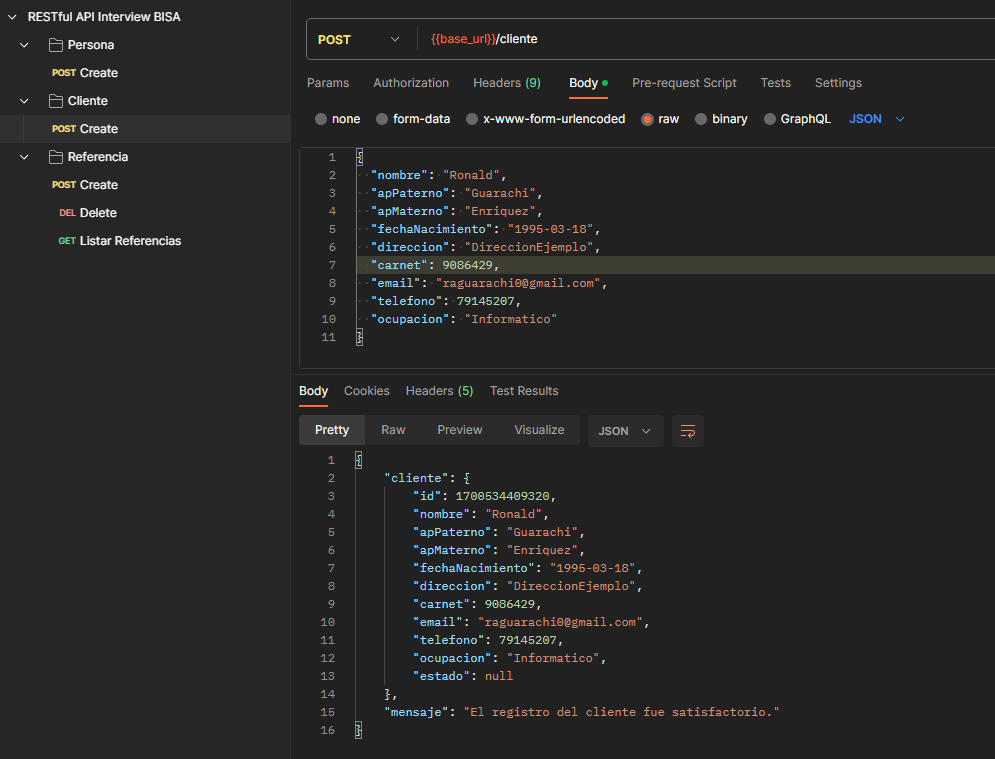
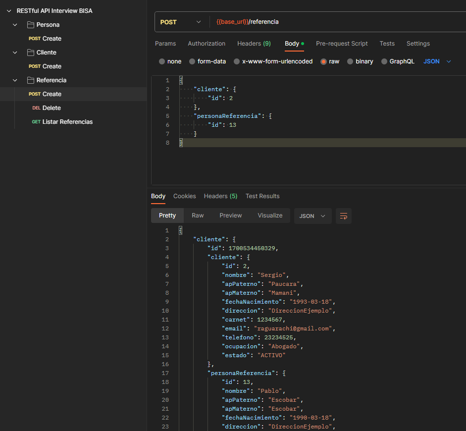
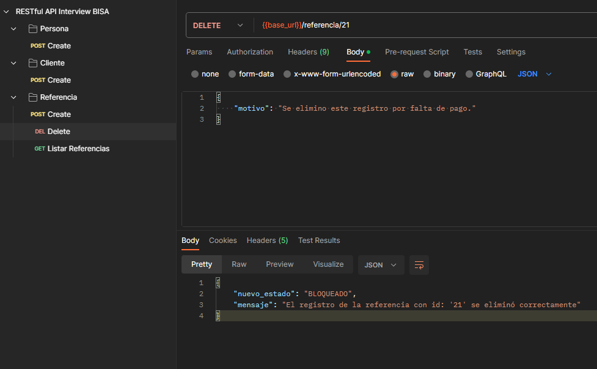
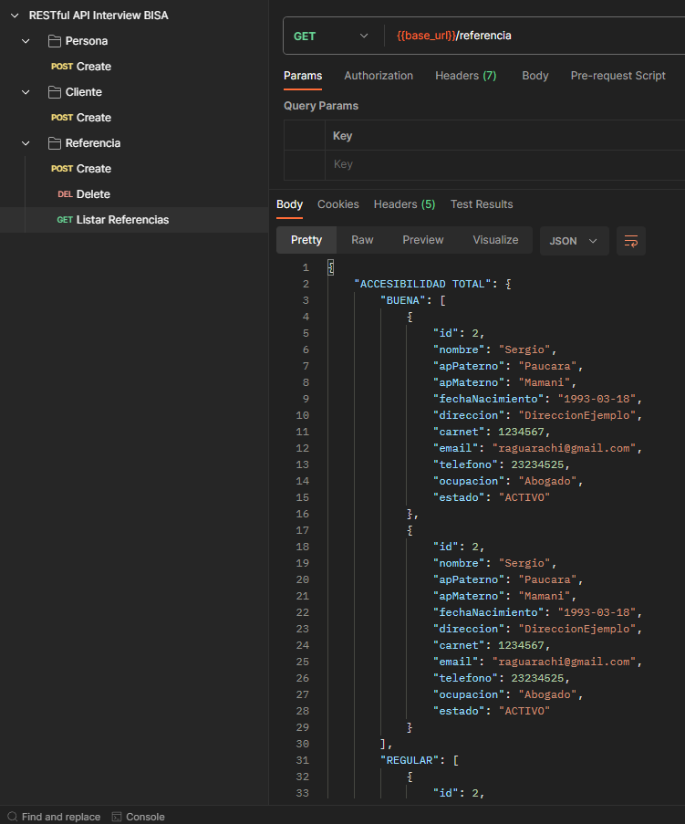

# Entrevista Banco BISA

En esta entrevesta se lleva a cabo la prueba técnica en el cual es una APIs REST necesarias para una aplicación de gestión de clientes. El objetivo de estas APIs es permitir determinar
la accesibilidad del cliente en base a la información de referencias registradas.

## Reseña de Tecnologia/Estrategia/Frameworks

Para el actual desarrollo se optó por utilizar Java 17 por las herramientas que posee actualmente,
además se optó por utilizar Spring Boot 2.7.5 debido a que personalmente estoy más acostumbrado a esa version 
y también por facilidad de tiempo.

La estrategia inicial fue la de crear dos relaciones para cada tabla `Cliente` y `Persona` pero considerandolo mejor 
es redundante utilizar dos entidades para casi el mismo propósito y es asi donde considere en crear una sola entidad 
`Persona` para los dos propositos utilizando un flag `Dtype` para diferenciarlos y tambien aprovechar la redundancia y 
aplicar el principio de _Open-Close_ de **SOLID**.

## Requisitos

- Java JDK 17
- Postman _(No obligatorio, pero práctico para  probar las API)_
- Maven _Si se requiere correr localmente_
- Docker
## Run Locally

Clona el proyecto

```bash
  git clone https://link-to-project
```

Ve a la ubicación del proyecto

```bash
  cd interview
```

Install dependencies

```bash
  mvn clean package
```

Inicia el servidor local

```bash
  java -jar ./target/interview-1.0.0-SNAPSHOT.war
```

## Run with Docker

Ve a la ubicacion del proyecto clonado:

```bash
  cd interview
```

Creamos la imagen:

```bash
docker build -t interview-bisa-ronald .
```
Creando el contenedor en el puerto **8080**:

```bash
docker run -p 8080:8080 interview-bisa-ronald
```

Listo! el servidor esta corriendo bajo Docker

## Database Access

Se escogió la base de datos H2 debido a la simplicidad en el despliegue de aplicaciones de prueba y test.

Para tener acceso a la base de datos se debe dirigir a la direccion: `http://localhost:8080/h2-console` el puerto puede variar si esta ocupado.


## API Reference

#### Crear una nueva Persona

```http
  POST /persona
```
Body JSON:

| Parameter         | Type     | Description                                                                  |
|:------------------|:---------|:-----------------------------------------------------------------------------|
| `nombre`          | `string` | **Required**. El nombre de la persona                                        |
| `apPaterno`       | `string` | **Required**. El apellido Paterno de la persona                              |
| `apMaterno`       | `string` | **Required**. El apellido Materno de la persona                              |
| `fechaNacimiento` | `string` | **Required**. La fecha de nacimiento de la persona en formato **yyyy-mm-dd** |
| `direccion`       | `string` | **Required**. La direccion de la persona                                     |
| `carnet`          | `number` | **Required**. El numero de carnet de la persona                              |

#### Crear un nuevo Cliente

```http
  POST /cliente
```
Body JSON:

| Parameter         | Type     | Description                                                                |
|:------------------|:---------|:---------------------------------------------------------------------------|
| `nombre`          | `string` | **Required**. El nombre del cliente                                        |
| `apPaterno`       | `string` | **Required**. El apellido Paterno del cliente                              |
| `apMaterno`       | `string` | **Required**. El apellido Materno del cliente                              |
| `fechaNacimiento` | `string` | **Required**. La fecha de nacimiento del cliente en formato **yyyy-mm-dd** |
| `direccion`       | `string` | **Required**. La direccion del cliente                                     |
| `carnet`          | `number` | **Required**. El numero de carnet del cliente                              |
| `email`           | `string` | El correo electronico del cliente                                          |
| `telefono`        | `number` | El numero de telefono del cliente                                          |
| `ocupacion`       | `string` | La ocupacion del cliente, por ejemplo 'Informático'                        |

#### Crear nueva Referencia

Crea una nueva referencia entre un Cliente y una Persona o un Cliente con un Cliente

```http
  POST /referencia
```
Body JSON:
``` json
{
    "cliente": {
        "id": number
    },
    "personaReferencia": {
        "id": number
    }
}
```

#### Elimina una referencia

Elimina una referencia otorgandole el id de la relación

```http
  DELETE /referencia/${id}
```

| Parameter | Type     | Description                                  |
|:----------|:---------|:---------------------------------------------|
| `motivo`  | `string` | El motivo de la eliminación de la referencia |

#### Listar por accesibilidad

Lista los clientes de acuerdo con la accesibilidad del cliente

```http
  GET /referencia
```
La respuesta tiene el siguiente formato:

``` json
{
    "ACCESIBILIDAD TOTAL": {
        "BUENA": [
            {clientes...}
        ],
        "REGULAR": [
            {clientes...}
        ],
        "MALA": [
            {clientes...}
        ],
        "NULA": [
            {clientes...}
        ]
    },
    "REFERENCIAS TIPO CLIENTE": {
        "BUENA": [
            {clientes...}
        ],
        "REGULAR": [
            {clientes...}
        ],
        "MALA": [
            {clientes...}
        ],
        "NULA": [
            {clientes...}
        ]
    }
}
```

## Postman Collection

La colección de Postman se encuentre en la raiz del proyecto: `./postman.collection`

Puedes importarlo desde Postman! `Postman > File > Import > Select file`

## Diagrama de Clases
La entidad Cliente extiende de la clase Persona, y un Cliente puede tener una referencia de otro Cliente como tambien de una persona, en el momento de la creacion de la clase Persona se crea automaticamente una columna `Dtype` que diferencia si es un Cliente o una Persona.

Acontinuación el diagrama de clases:


## Datos de Prueba

Se insertaron datos de prueba para facilitar el proceso de testeo:

### CLIENTES

| id | dtype   | nombre  | ap_paterno | ap_materno | fecha_nacimiento | direccion        | carnet  | email                 | telefono | ocupacion   | estado    |
|----|---------|---------|------------|------------|------------------|------------------|---------|-----------------------|----------|-------------|-----------|
| 1  | Cliente | Ronald  | Guarachi   | Enriquez   | 1995-03-18       | DireccionEjemplo | 9086429 | aligatorbol@gmail.com | 79145207 | Informatico | ACTIVO    |
| 2  | Cliente | Sergio  | Paucara    | Mamani     | 1993-03-18       | DireccionEjemplo | 1234567 | raguarachi@gmail.com  | 23234525 | Abogado     | ACTIVO    |
| 3  | Cliente | Claudia | Yupanqui   | Rojas      | 1992-03-18       | DireccionEjemplo | 1234567 | cyupanqui@gmail.com   | 23234525 | Arquitecto  | BLOQUEADO |

### PERSONAS

| id | dtype   | nombre | ap_paterno | ap_materno | fecha_nacimiento | direccion        | carnet  |
|----|---------|--------|------------|------------|------------------|------------------|---------|
| 11 | Persona | Ruben  | Hernandez  | Torrez     | 1992-03-18       | DireccionEjemplo | 2324535 |
| 12 | Persona | Maria  | Magdalena  | Fernandez  | 1991-03-18       | DireccionEjemplo | 1646344 |
| 13 | Persona | Pablo  | Escobar    | Escobar    | 1990-03-18       | DireccionEjemplo | 1646344 |

### REFERENCIAS

| id | eliminado | motivo_eliminado | cliente_id | persona_referencia_id |
|----|-----------|------------------|------------|-----------------------|
| 21 | false     | Sin eliminar     | 1          | 11                    |
| 22 | false     | Sin eliminar     | 2          | 12                    |
| 23 | false     | Sin eliminar     | 2          | 13                    |
|    |           |                  |            |                       |

### Screenshots
Persona creation:


Cliente creation:


Referencia creation:


Referencia deletion:


Listado de referencias según accesibilidad:



### Feedback

Se noto algunas observaciónes al momento del desarrollo, considerandose lo mas construtivo posible:

- La categorización para la accesibilidad de los clientes es confusa, debido a que muchos valores podrian repetirse en el proceso.
- El tener una columna "estado" para el cliente puede llegar a tener problemas de escalabilidad a 
largo plazo, es recomendable tener un modulo a parte para calcular el estado de las entidades.

## Author
_Ronald Alcides Guarachi Enriquez - Software Engineer_
- [@skynoorz](https://github.com/skynoorz)
